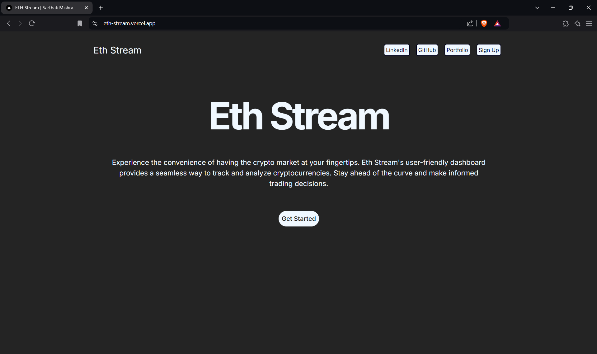
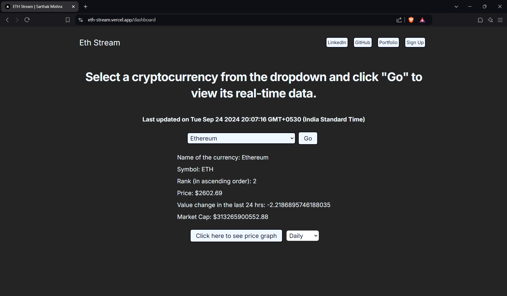
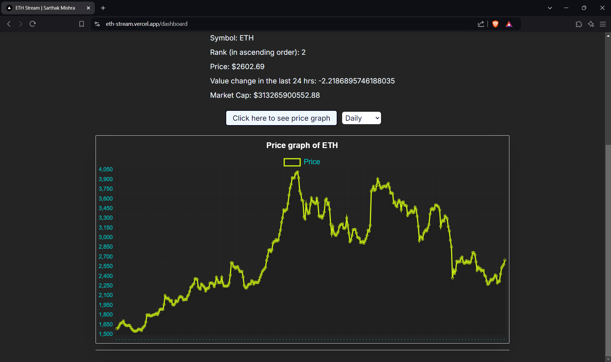

# Eth Stream

Eth Stream is a web application that allows users to view real-time Ethereum data, including price, market cap, symbol, rank, and more. It also provides an interactive price graph with various duration options. Built with Next.js and Chart.js, the app fetches data from the CoinCap API and is deployed on Vercel. The app also supports user authentication via OAuth for sign-in/sign-up.

## Key Features
- Real-time Ethereum price updates
- Market cap, symbol, price, rank display etc
- Price graph with multiple time intervals:
  - Daily
  - 1 min, 5 min, 15 min, 30 min
  - 1 hr, 2 hr, 6 hr, 12 hr
- OAuth sign-in/sign-up for user authentication
- Responsive design for all devices
- Smooth user experience with fast data retrieval

## Snippets
<h3>Eth Stream Landing</h3>

<h3>Eth Stream 1</h3>

<h3>Eth Stream 2</h3>

## Short Description
Eth Stream leverages the CoinCap API to display real-time Ethereum market data. Users can track Ethereum's price, market cap, symbol, rank, and analyze price trends over various time frames using interactive charts powered by Chart.js. The app includes OAuth-based sign-in and sign-up for a seamless user experience. It is optimized for performance and deployed on Vercel.

## Tech Used
- **Frontend:** Next.js
- **Charts:** Chart.js
- **API:** CoinCap API
- **Authentication:** OAuth
- **Deployment:** Vercel

## How to Use

1. Clone the repository: `git clone https://github.com/sarthakmishraa/eth-stream.git`

Feel free to clone the repository and explore the project. Contributions are welcome!

## Contributing
Contributions are welcome! Please fork the repository and submit a pull request.